## Overview
- By monitoring container events and combining container configuration data, AutoSEL fully automates the generation, update, and application of SELinux policies.
- Users don’t need to manually load policy files. This reduces repetitive operations and improves responsiveness to configuration changes. Run it once to complete policy generation and updates. Privileged containers and resource mounts are strictly governed by policy.

####   [AutoSEL](https://github.com/ChongZhe001025/AutoSEL)
---

## System Architecture

- System context diagram

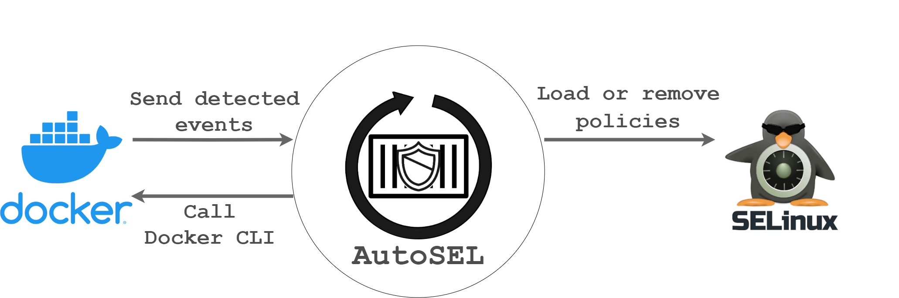

- Interaction design among system components

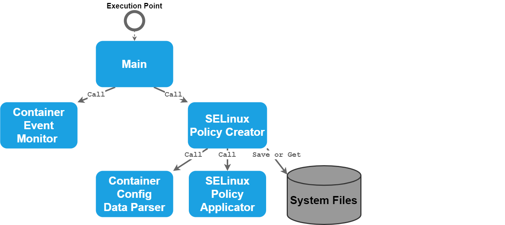

- Program workflow design

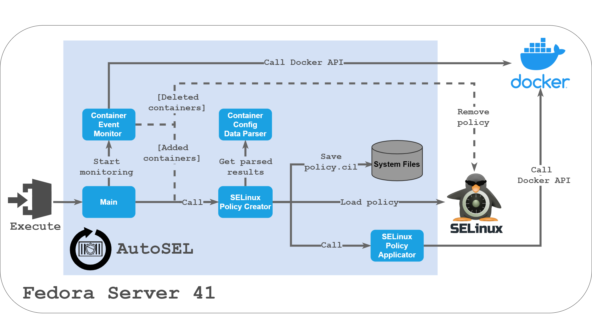

#### Container Monitoring Component
- Monitor Docker container events
- Execute corresponding actions based on the event type

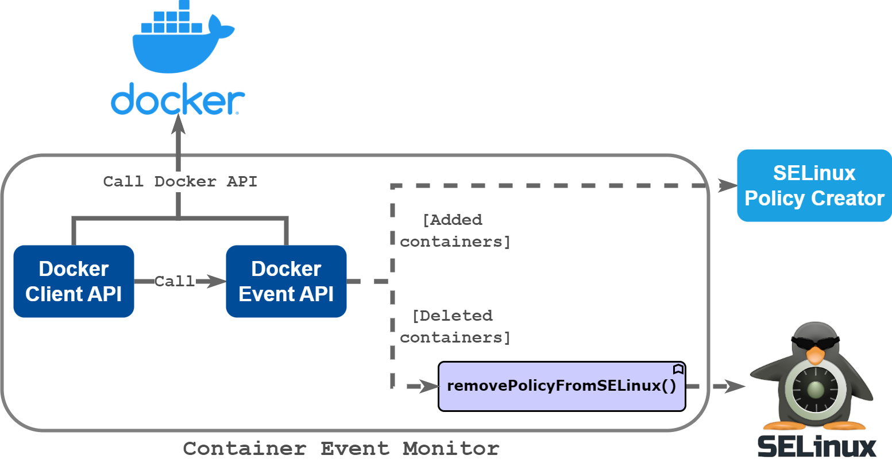

#### Container Configuration Parser
- Retrieve container configuration and inspection results
- Parse the content and dispatch to the appropriate data extraction methods

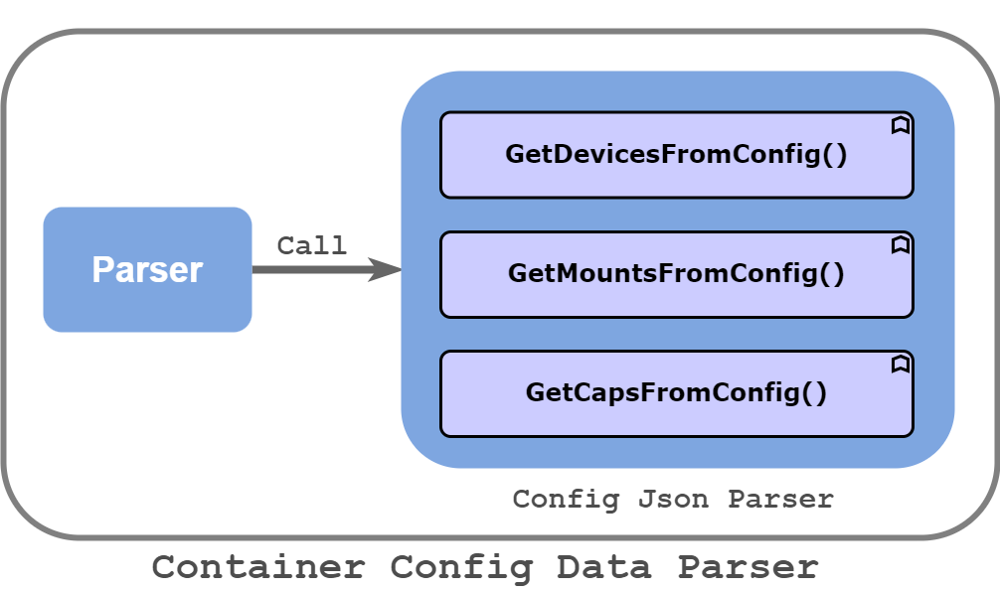

#### Policy Creator
- Generate the corresponding SELinux policy for a given container
- Load the policy into SELinux

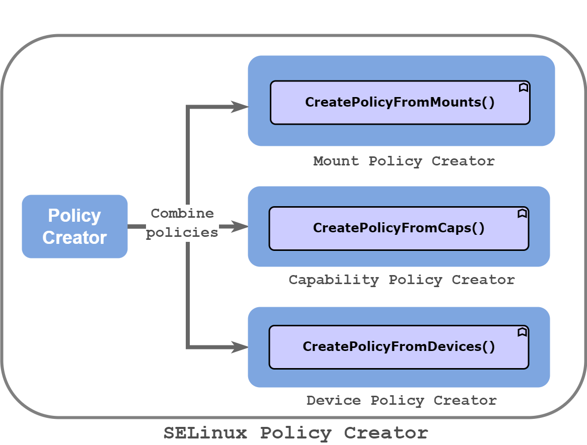

#### SELinux Policy Applicator
- Stop the container
- Export the container filesystem as an archive
- Import the archive into Docker and rebuild the image
- Remove the original container
- Create a new container with customized SELinux labels

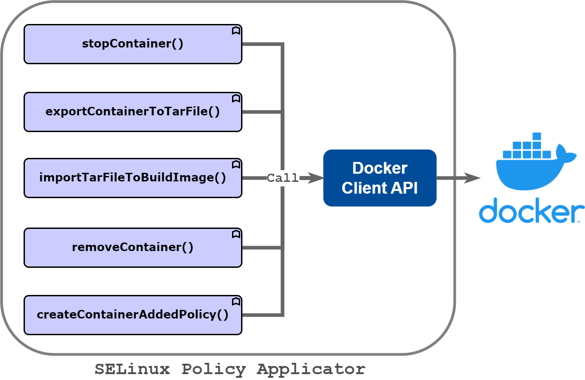

---

## Demonstrations

#### AutoSEL — Automatic Policy Generation
- Once AutoSEL starts, it detects all current containers, generates configuration files to build policies, and loads them into SELinux. It automatically removes old containers and copies data, recreates containers with the policies applied, and finally starts listening for container events.

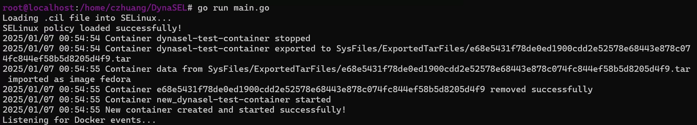

#### AutoSEL — Automatic Policy Reload
- When AutoSEL detects container events, it pauses monitoring, runs a new round of policy generation and container replacement, and then resumes monitoring.

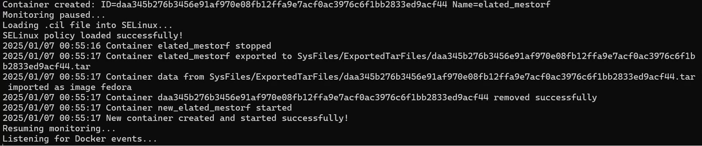

#### Handling Privileged Containers
- AutoSEL only allows the necessary resources. If a container is switched to privileged mode, it adjusts the policy to add restrictions, preventing risky system-level operations.

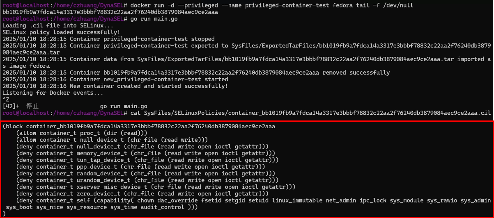

#### Policies for Device Mounts
- The following illustrates device-mount blocking. The upper red block shows a successful mount before enforcement; the lower block shows a mount blocked after enabling AutoSEL.

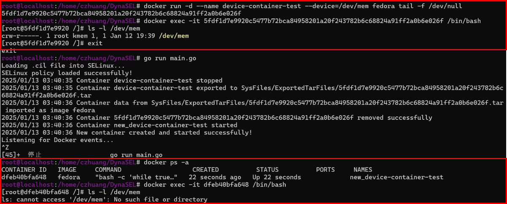

#### Policies for Host Mounts
- Before enabling AutoSEL: successful host mount.

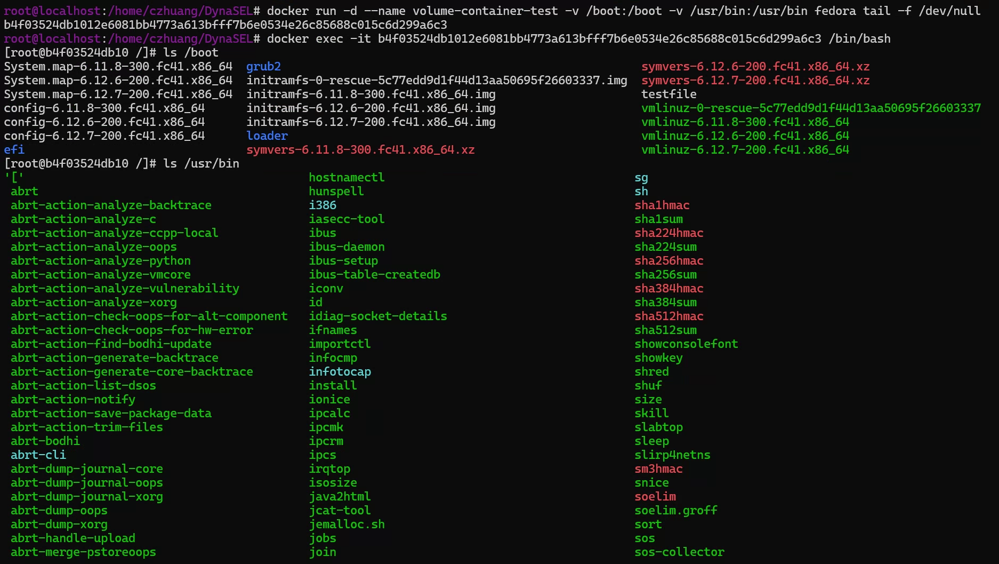

- After enabling AutoSEL: host mount is blocked.

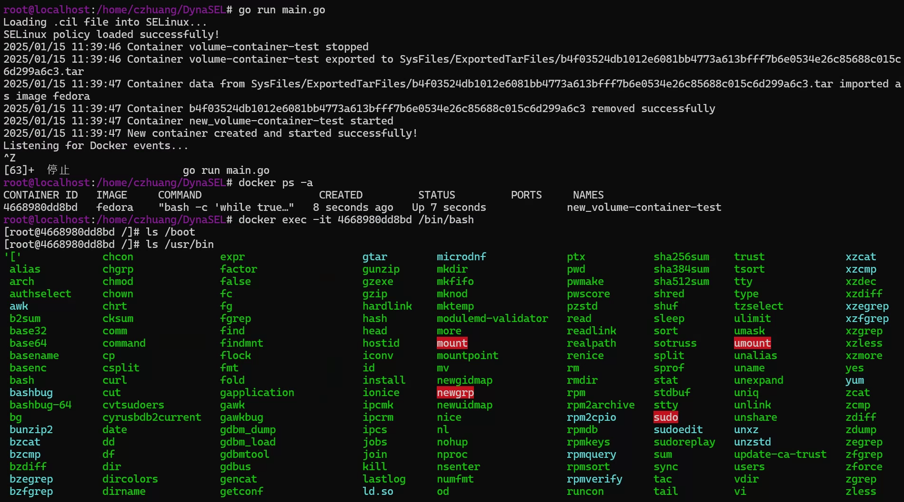

#### Policies for System Capabilities
- The following shows blocking system-level capabilities. The upper red block shows a successful capability enable and mounting of host /mnt/test; the lower block shows the action blocked after enabling AutoSEL.

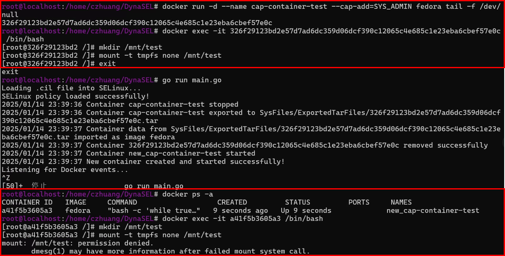

---

## Contribution
- AutoSEL can automatically generate and apply SELinux policies based on container configuration, significantly improving the security and operational efficiency of containers. It addresses the lack of flexibility in traditional SELinux policy management in containerized environments.
- With its automated design, AutoSEL reduces repetitive manual steps and error risks, enabling users to operate efficiently and accurately even in multi-container environments.