## Overview 
- 透過監控容器事件，結合容器配置資訊，實現 SELinux 策略的生成、更新與應用流程全自動化。  
- 不需要使用者手動載入配置文件，顯著降低操作重複性，並提升對配置變化的響應能力，僅需執行一次即可完成策略生成與更新，特權容器與資源掛載的權限管控更為嚴格。

####   [AutoSEL](https://github.com/ChongZhe001025/DynaSEL/tree/latest)
---

## 系統架構

- **系統環境圖** 

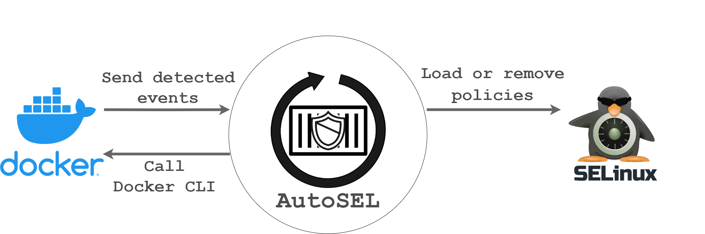

- **系統元件間的互動設計**  

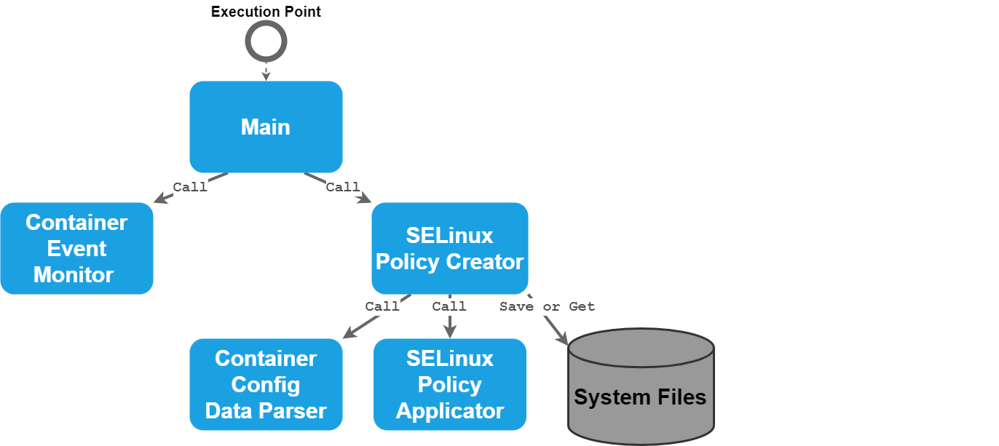

- **系統程式工作流程設計**  

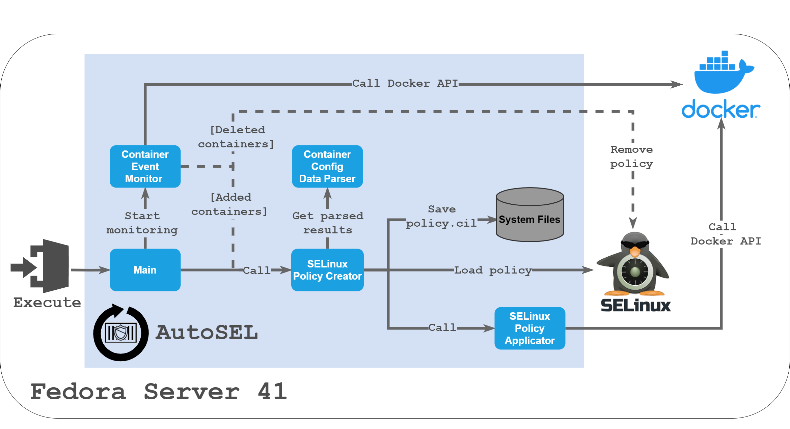

#### 容器監控元件
- **監控 Docker 容器的事件**
- **根據不同事件類型執行對應操作**  

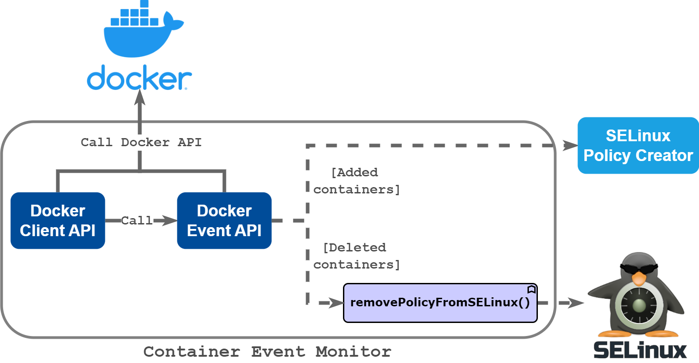

#### 容器配置文件分析元件
- **獲取容器的配置文件內容與檢查結果**
- **內容分析後傳遞至不同的資料提取方法**  

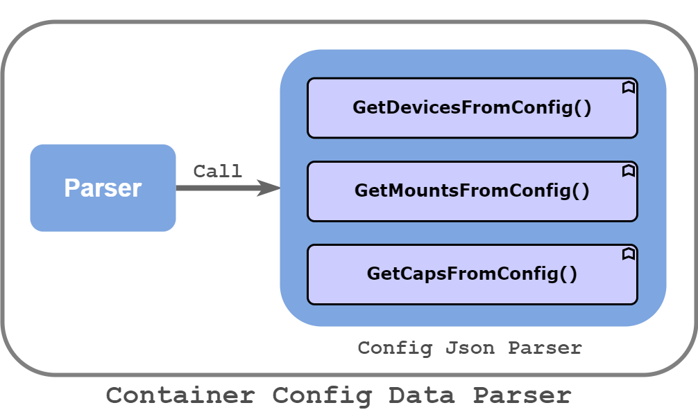

#### 策略建立元件
- **針對指定容器生成對應 SELinux 策略**
- **將策略載入 SELinux**  

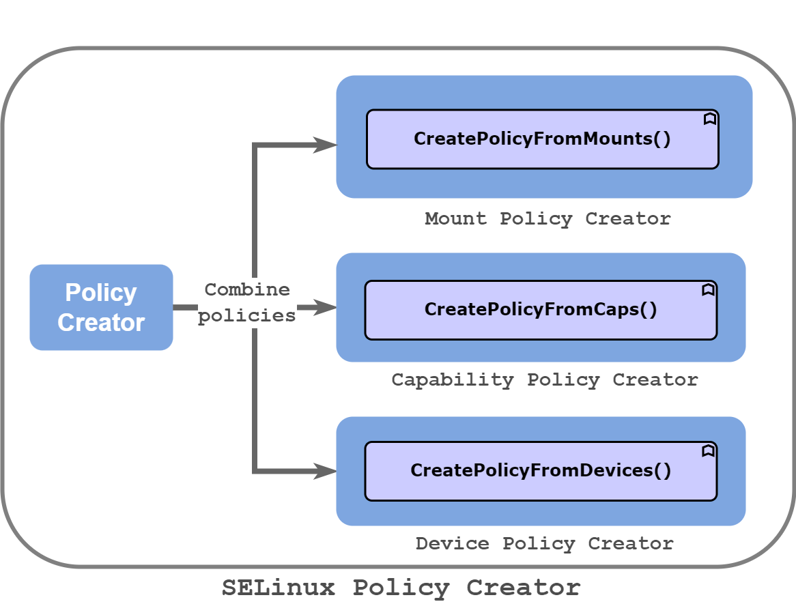

#### SELinux 策略應用元件設計
- **停止容器**
- **匯出容器文件系統為壓縮檔**
- **匯入檔案至 Docker 並重建容器映像**
- **刪除原始容器**
- **使用客製化 SELinux 標籤建立新容器**  

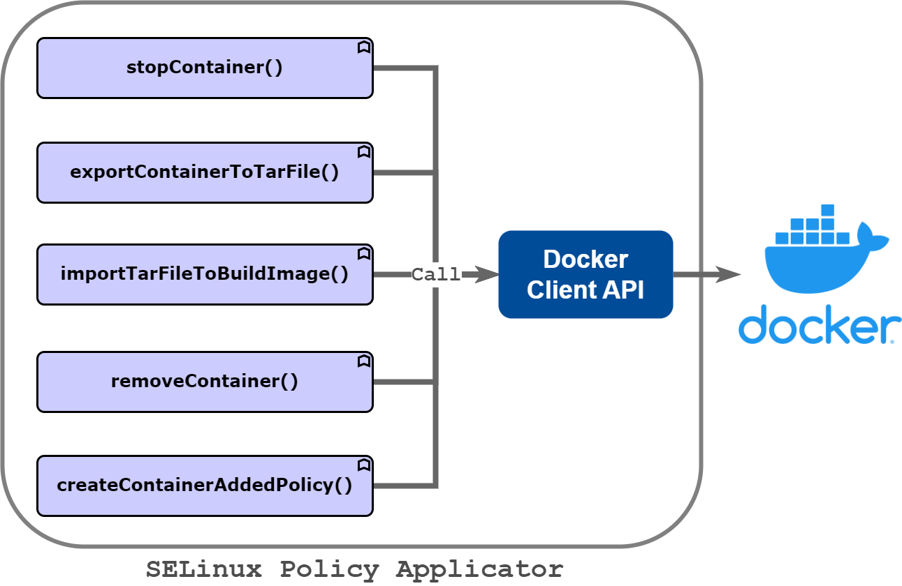

---

## 實際案例

#### `AutoSEL` 自動生成策略
  - `AutoSEL` 只需要執行程式，就會自動偵測目前在在的所有容器，並產出配置文件用以建立策略，再載入 SELinux，系統會自行移除舊容器並複製資料，依照資料建立新容器並套用策略，最後開啟容器事件監聽。
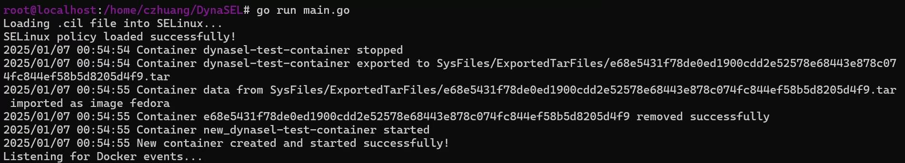

#### `AutoSEL` 自動化載入策略
- 若 `AutoSEL` 監聽到容器事件，會自動暫停監聽並執行新一輪的制定策略、套用新容器，再繼續監聽。
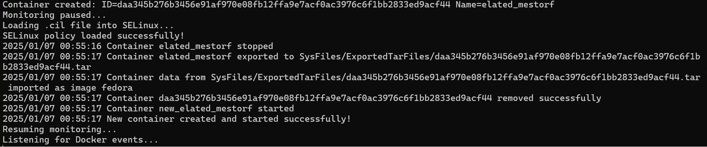
#### `AutoSEL` 針對特權容器的處理
- `AutoSEL` 只允許必要的資源，一旦改成特權模式執行，則會修改權限策略增加限制，可以避免系統層面的危險操作。
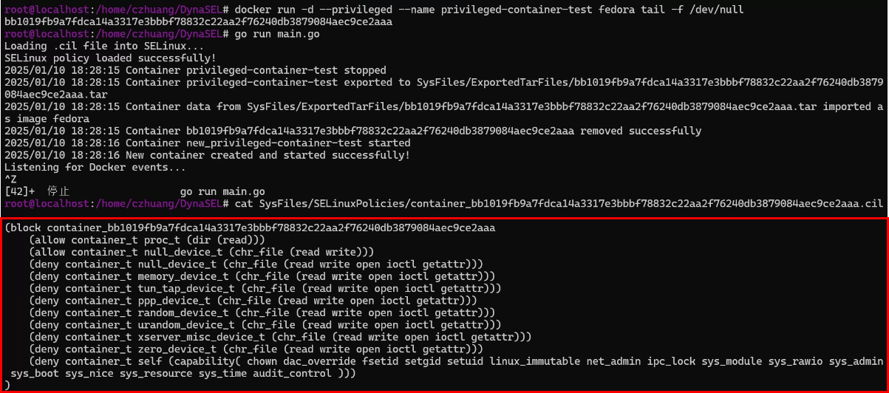

#### 針對設備掛載的策略
- `AutoSEL` 針對設備掛載的實際阻擋狀況如圖所示，上方紅色區塊表示成功掛載的輸出案例；下方則表示了啟用 `AutoSEL` 後被阻擋掛載的輸出案例
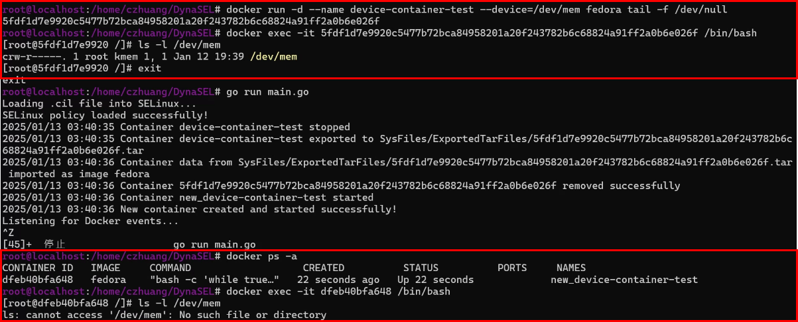

#### 針對主機掛載的策略
- `AutoSEL` 針對主機掛載的實際阻擋前如圖所示，表示成功掛載的輸出案例。
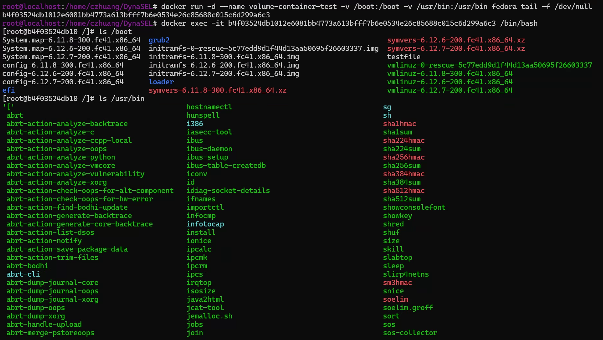
- `AutoSEL` 針對主機掛載的實際阻擋後如圖所示，表示啟用 `AutoSEL` 後被阻擋掛載的輸出案例。
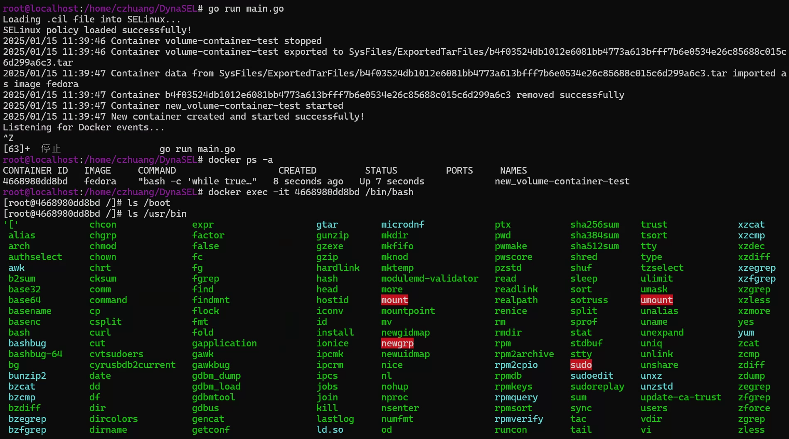

#### 針對系統權限的策略
- `AutoSEL` 針對系統操作權限的實際阻擋狀況如圖所示，上方紅色區塊表示成功啟用系統權限的輸出案例，可以看出容器成功取得權限並成功掛載主機/mnt/test；下方則表示了啟用 `AutoSEL` 後被阻擋系統權限的輸出案例
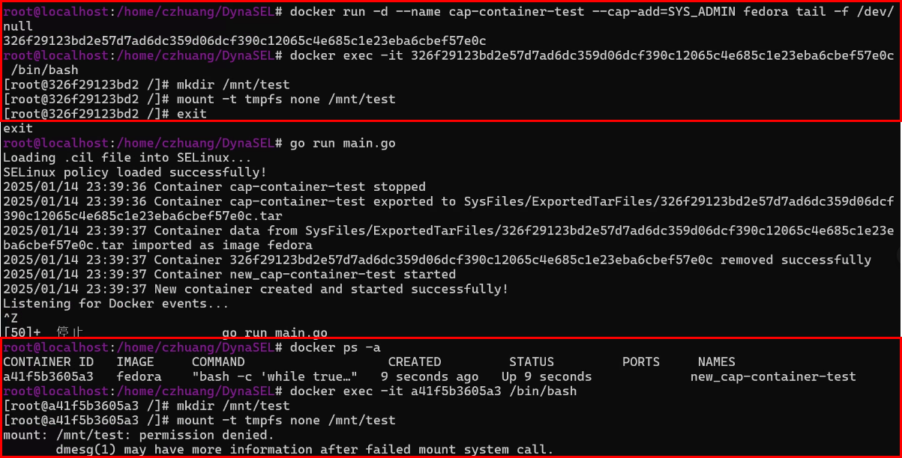
---

## 貢獻
- `AutoSEL` 能根據容器配置自動生成並應用符合容器需求的 SELinux 策略，大幅提升了容器運行的安全性與管理效率，解決傳統 SELinux 策略管理在容器化環境中缺乏靈活性的問題。  
- `AutoSEL` 採用自動化的設計，減少了手動操作中可能出現的重複性與錯誤風險，使得即使是在多容器環境下，使用者仍能以高效、準確的方式完成操作。